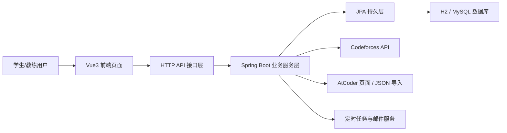

# 算法竞赛训练管理系统的设计与实现

## 中文摘要

随着高校算法竞赛活动的持续开展，训练过程中的数据管理、任务分配、学生状态跟踪和比赛组织问题逐渐突出。传统依赖表格、聊天工具和人工统计的管理方式存在信息分散、更新不及时、训练效果难量化等不足，难以满足竞赛训练团队对精细化管理和数据化分析的实际需求。针对上述问题，本文设计并实现了一套算法竞赛训练管理系统。

本系统采用前后端分离架构，前端基于 Vue3、TypeScript、Pinia、Vue Router、Element Plus 与 ECharts 实现页面交互和可视化展示；后端基于 Spring Boot、Spring Data JPA、Spring Security、Spring Cache 与 Spring Mail 实现业务逻辑、数据持久化、权限控制和通知功能。系统面向学生与教练两类用户，提供训练任务管理、题单管理、题库检索、积分排行、趋势分析、队伍管理、学生批量导入、比赛提醒和异常预警等功能。同时，系统接入 Codeforces 与 AtCoder 平台，实现评分、比赛历史和通过题记录同步，并支持 AtCoder 提交记录 JSON 导入，提升训练数据的真实性和完整性。在此基础上，系统构建了基于评分和做题量的训练画像模型，通过隐藏分计算与分层推荐策略生成个性化题目建议，并结合定时任务与邮件服务实现比赛提醒和异常通知。

测试结果表明，该系统能够完成算法竞赛训练场景下的主要业务流程，后端单元测试可以通过，前端生产构建能够成功完成，系统具备较好的可用性和工程实践价值。本文的研究工作对算法竞赛训练团队的信息化建设与数字化管理具有一定的现实意义。

关键词：算法竞赛；训练管理；前后端分离；数据同步；题目推荐

## Abstract

With the continuous development of competitive programming training in universities, problems related to data management, task assignment, student progress tracking, and contest organization have become increasingly prominent. Traditional management methods based on spreadsheets, chat tools, and manual statistics suffer from scattered information, delayed updates, and difficulty in evaluating training effectiveness, which can no longer satisfy the practical needs of refined and data-driven management for programming contest teams. To address these problems, this paper designs and implements an algorithm contest training management system.

The system adopts a front-end and back-end separated architecture. The front end is built with Vue3, TypeScript, Pinia, Vue Router, Element Plus, and ECharts to provide user interaction and visualization, while the back end is implemented with Spring Boot, Spring Data JPA, Spring Security, Spring Cache, and Spring Mail to support business logic, data persistence, permission control, and notification services. The system serves both students and coaches, and provides functions such as training task management, problem set management, problem searching, point ranking, trend analysis, team management, batch student import, contest reminders, and abnormal training alerts. In addition, the system integrates with Codeforces and AtCoder to synchronize ratings, contest history, and accepted problem records, and also supports importing AtCoder submission records in JSON format to improve the authenticity and completeness of training data. Based on these data, the system builds a training profile model using ratings and problem-solving statistics, calculates a hidden rating, and generates layered personalized recommendations. Scheduled tasks and email services are further used to send contest reminders and abnormal training notifications.

Test results show that the system can complete the major business workflows in the algorithm contest training scenario. The back-end unit tests pass successfully, and the front-end production build can be completed, indicating that the system has good usability and engineering practice value. The work presented in this paper has practical significance for the informatization and digital management of competitive programming teams.

Keywords: algorithm contest; training management; front-end and back-end separation; data synchronization; problem recommendation

## 目录

第 1 章 绪论  
第 2 章 相关技术与可行性分析  
第 3 章 系统需求分析  
第 4 章 系统设计  
第 5 章 系统实现  
第 6 章 系统测试  
第 7 章 总结与展望  
致谢  
参考文献  
附录  

# 第 1 章 绪论

## 1.1 研究背景

近年来，算法竞赛训练在高校程序设计教学、创新实践和竞赛选拔中发挥着越来越重要的作用。与普通课程实验不同，算法竞赛训练具有训练周期长、题目难度跨度大、参训成员水平差异明显、训练数据来源分散等特点。学生通常需要在 Codeforces、AtCoder、洛谷等多个平台上进行训练，教练则需要持续关注学生的做题数量、评分变化、比赛参与情况以及阶段性训练效果。若仍然依赖人工统计、口头反馈或简单表格记录，不仅管理效率较低，而且难以形成长期、连续、可信的数据积累。

在传统训练组织模式下，常见问题主要体现在以下几个方面：一是训练数据分散在多个在线评测平台，教练难以及时掌握学生的真实训练情况；二是训练任务、题单、比赛提醒和队伍安排之间缺乏统一的信息化支撑；三是学生训练过程难以量化，做题数量、难度分布和近期状态往往无法直观展示；四是异常训练行为难以及时发现，例如短时间内训练波动过大、长期缺乏有效训练或比赛安排遗漏等情况。以上问题都说明，算法竞赛训练场景迫切需要一套面向实际业务过程的训练管理系统。

随着前后端分离架构、轻量级 Web 框架和数据可视化技术的发展，构建具有训练数据同步、状态分析、任务管理和提醒通知功能的管理系统已经具备较好的技术条件。基于此，本文结合算法竞赛训练场景的实际需求，设计并实现一套算法竞赛训练管理系统，用于提升训练组织效率、增强训练过程可视化能力，并为教练决策和学生自我调整提供数据支持。

## 1.2 研究意义

### 1.2.1 应用意义

本课题的首要意义在于实际应用价值。对于教练而言，系统可以统一管理学生账号、训练任务、比赛提醒、队伍信息和异常预警，减少重复性人工统计工作，提高训练组织效率。对于学生而言，系统能够展示个人积分、训练趋势、题型分布、比赛历史和推荐题目，帮助学生更清晰地了解自身训练状态，从而进行更有针对性的训练安排。对于训练团队整体而言，该系统能够将分散的训练数据沉淀为统一的数据资产，为后续训练评估、队伍组建和竞赛备赛提供支撑。

### 1.2.2 技术意义

本课题综合应用了前后端分离开发、数据持久化、外部平台数据同步、规则建模、缓存、定时任务、邮件通知和可视化展示等技术，具有较强的工程实践意义。系统并非只实现单一的信息录入，而是围绕真实训练场景构建完整的业务闭环。通过将外部 OJ 数据接入、训练画像构建、题目推荐、比赛提醒和异常预警等模块进行整合，能够体现软件工程中需求分析、系统设计、模块协同和业务规则实现的完整过程。

## 1.3 国内外相关系统概述

当前，算法竞赛训练通常依赖多个独立平台共同完成。Codeforces、AtCoder 等在线评测平台能够提供比赛、评分和题目训练能力，但这些平台更关注通用竞赛服务，难以直接满足校内训练队在学生管理、批量导入、队伍组织、训练任务安排和教练侧分析方面的实际需求。部分训练团队会使用表格、聊天工具或简单的内部页面维护成员信息和训练记录，但这类方式通常缺乏统一的数据同步机制和规范化的业务流程支持。

从管理信息系统的角度看，现有常见系统往往偏向教学管理、课程作业管理或通用任务协作，而算法竞赛训练具有更强的专项性。其核心不只是任务发布，还包括训练数据采集、训练水平评估、题目分层推荐、比赛提醒和异常状态识别等内容。因此，设计一套面向算法竞赛场景的训练管理系统，既要保留管理系统在用户、数据和流程上的规范性，也要体现竞赛训练业务的特点。

基于以上分析可以看出，现有通用平台难以覆盖算法竞赛训练的完整业务闭环，这也构成了本文研究与实现该系统的现实基础。

## 1.4 本文的主要研究内容

围绕算法竞赛训练管理需求，本文主要开展以下工作：

1. 对算法竞赛训练场景进行需求分析，明确学生和教练两类角色的核心业务需求。
2. 设计系统的总体架构、功能模块、数据模型和接口组织方式，构建前后端分离的训练管理平台。
3. 实现训练任务、学生管理、队伍管理、题单管理、比赛提醒、排行榜和积分流水等基础管理功能。
4. 接入 Codeforces 和 AtCoder 外部数据源，实现评分、比赛历史和通过题记录同步，并补充 AtCoder JSON 导入能力。
5. 基于评分与做题量构建训练画像与隐藏分，进一步实现题目推荐、训练可视化分析和异常预警。
6. 通过测试验证系统在主要训练管理场景下的可用性和正确性，并总结当前不足与后续改进方向。

## 1.5 论文结构安排

本文共分为七章。第 1 章为绪论，介绍课题研究背景、研究意义、相关系统概况、主要研究内容以及论文结构安排；第 2 章介绍系统开发涉及的关键技术，并对系统建设的可行性进行分析；第 3 章对系统进行需求分析，明确角色需求、功能需求和非功能需求；第 4 章对系统总体架构、数据库结构、接口组织方式以及核心业务流程进行设计；第 5 章阐述系统各功能模块的具体实现过程；第 6 章对系统进行测试，验证主要功能的正确性与业务流程的完整性；第 7 章对本文工作进行总结，并提出系统后续的优化方向。

# 第 2 章 相关技术与可行性分析

## 2.1 前后端分离架构

本系统采用前后端分离架构进行设计与实现。前端主要负责页面展示、用户交互、表单输入、数据图表绘制和路由跳转，后端主要负责业务逻辑处理、数据存储、权限控制、外部接口调用和规则计算。前后端通过 HTTP 接口进行数据交互，返回统一结构的数据结果。

采用前后端分离架构具有以下优势：一是前端界面开发与后端业务逻辑开发可以并行推进，提升开发效率；二是系统界面和业务能力边界清晰，便于后续维护和功能扩展；三是便于接入图表、异步加载和分页查询等交互能力，提高用户使用体验。对于本课题而言，该架构尤其适合学生端和教练端双角色页面的协同开发，也有利于后续部署和接口测试。

## 2.2 Spring Boot 相关技术

Spring Boot 是当前 Java Web 开发中常用的轻量级后端框架，具备自动配置、快速集成和生态完善等优点。本系统基于 Spring Boot 构建后端服务，以 REST 风格接口方式对外提供功能支持。

在具体实现中，系统综合使用了以下技术组件：

- Spring Web：用于构建控制器和 HTTP 接口，完成训练任务、学生管理、比赛提醒、题目推荐等模块的请求处理。
- Spring Validation：用于对请求参数进行校验，提高接口输入的规范性。
- Spring Data JPA：用于实现实体对象与数据库表之间的映射，减少重复的数据访问代码。
- Spring Security：用于构建基础权限控制机制，对学生与教练角色进行访问区分。
- Spring Cache：用于缓存部分查询结果，减少重复计算与数据库访问压力。
- Spring Mail：用于实现比赛提醒和异常预警的邮件通知功能。

上述技术共同构成了系统后端的主要支撑框架，使系统在保持开发效率的同时具备较好的模块化和可维护性。

## 2.3 数据持久化与数据库技术

系统在开发阶段采用 H2 数据库，以便于快速运行和本地调试；在部署阶段可切换至 MySQL 数据库，以满足更稳定的数据持久化需求。该方案兼顾了开发便利性与部署实用性。

在数据访问层，系统使用 Spring Data JPA 管理实体对象，包括学生信息、用户账号、训练任务、比赛提醒、队伍成员、积分记录、异常告警等核心数据。相较于直接书写大量 SQL，JPA 能够通过实体建模与仓储接口减少样板代码，提高开发效率，同时便于根据业务对象组织代码结构。

## 2.4 Vue3 与 TypeScript 前端技术

前端部分采用 Vue3 作为核心框架，并结合 TypeScript 构建页面逻辑。Vue3 具有组件化程度高、响应式机制完善、生态成熟等优点，适合中小型业务系统的快速开发。TypeScript 在 JavaScript 基础上增加了类型系统，能够提升接口调用、状态管理和组件开发的可维护性，减少因字段不一致带来的前后端联调问题。

系统还结合以下前端技术完成具体功能：

- Vue Router：用于系统页面路由管理和角色访问控制。
- Pinia：用于维护登录状态和用户角色信息。
- Element Plus：用于快速搭建表单、表格、弹窗、按钮和提示组件。
- ECharts：用于绘制训练趋势图、题型分布图等数据可视化内容。

## 2.5 外部平台数据接入技术

本系统的重要特点之一是引入了外部在线评测平台的数据接入能力。对于 Codeforces，系统通过官方开放接口获取比赛列表、评分信息及相关数据；对于 AtCoder，系统采用页面解析与 JSON 导入相结合的方式补全训练明细。该设计既提升了数据真实性，也增强了系统对真实训练场景的适配能力。

## 2.6 定时任务与邮件通知技术

为了满足比赛提醒和异常预警的业务需求，系统引入了定时任务与邮件通知机制。后端通过定时调度周期性执行官方比赛同步、比赛提醒检查和异常邮件发送等任务，使提醒功能具有一定的自动化能力。邮件通知功能则通过 Spring Mail 实现，从而使系统不仅具备数据展示能力，还具备主动通知能力。

## 2.7 系统可行性分析

### 2.7.1 技术可行性

本系统所采用的 Spring Boot、Vue3、TypeScript、JPA、ECharts 等技术均为成熟方案，开发文档完善，学习和实现成本可控。系统的核心功能如用户管理、分页查询、图表展示、文件导入、定时任务和邮件发送，均可通过现有技术栈稳定实现，因此技术上具有可行性。

### 2.7.2 经济可行性

本系统面向毕业设计场景开发，主要依赖开源框架和公开平台数据，不需要额外购买商业软件或高成本硬件资源。开发和运行环境要求较低，普通个人计算机即可完成开发、调试和演示，因此具有较好的经济可行性。

### 2.7.3 运行可行性

系统面向学生和教练两类用户，业务流程清晰，页面结构直观，常见操作包括登录、查看数据、导入文件、同步 OJ、管理比赛和查看提醒等，整体操作门槛较低。同时，系统采用 Web 方式运行，用户无需安装复杂客户端，具备较好的运行可行性。

## 2.8 本章小结

本章介绍了系统开发所依赖的关键技术，包括前后端分离架构、Spring Boot 相关后端技术、数据库持久化方案、Vue3 与 TypeScript 前端技术、外部平台数据接入方式以及定时任务与邮件通知机制，并从技术、经济和运行三个角度分析了系统建设的可行性。

# 第 3 章 系统需求分析

## 3.1 业务场景分析

算法竞赛训练通常由教练统一组织，学生根据训练任务、比赛安排和个人能力进行分层练习。与一般课程型系统相比，训练管理场景更强调过程跟踪、水平画像和实时反馈。系统在本项目中的应用场景主要包括以下几个方面：

1. 教练需要维护学生账号信息，批量导入学生数据，并为学生补充或校验竞赛平台账号。
2. 学生需要在系统中查看个人训练画像、近 7 天做题趋势、比赛历史和推荐题目。
3. 教练需要根据队伍训练安排发布任务、布置题单，并跟踪学生完成情况。
4. 系统需要周期性同步 Codeforces 和 AtCoder 的公开数据，以减少人工录入成本。
5. 系统需要在比赛即将开始或训练行为异常时，主动提醒教练及时介入。

因此，论文中的需求分析不仅要覆盖基础信息管理，还要覆盖数据同步、画像计算、推荐生成和通知机制等扩展业务。

## 3.2 角色需求分析

### 3.2.1 学生角色需求

学生是系统的主要使用者之一，其核心需求集中在个人训练管理与信息查询方面。学生登录系统后，应能够完成以下操作：

- 查看个人训练信息，包括积分、总做题数、Codeforces 和 AtCoder 评分、比赛历史等。
- 查看个人训练趋势图和题型分布图，了解近期训练表现。
- 查询推荐题目和题库列表，根据当前水平制定训练计划。
- 查看训练任务与题单状态，并进行完成标记或进度更新。
- 绑定 Codeforces 和 AtCoder 账号，触发真实 OJ 数据同步。
- 上传 AtCoder 提交记录 JSON 文件，补全公开数据无法覆盖的做题信息。
- 查看个人队伍信息、收到的组队邀请以及比赛提醒。

### 3.2.2 教练角色需求

教练角色更偏向系统管理与训练组织，其核心需求包括：

- 维护学生信息，新增、修改和批量导入学生账号。
- 同步指定学生的 OJ 数据，查看学生训练概况和异常提醒。
- 管理训练任务、比赛提醒、队伍信息和题单资源。
- 查看全队或全体学生的排行榜、积分日志和学生列表。
- 对比赛进行官方同步或手工补录，并按提醒规则推送邮件通知。
- 查看异常告警信息，并根据提醒及时调整训练安排。

### 3.2.3 系统角色权限边界

系统采用学生和教练双角色设计。学生角色主要拥有查看、提交和更新个人训练相关信息的权限；教练角色除查看外，还拥有学生管理、比赛管理、同步控制和队伍配置等管理权限。该设计能够确保系统在功能开放性和数据安全性之间保持平衡。

## 3.3 功能需求分析

结合项目现有实现，系统功能可以划分为以下八个模块。

### 3.3.1 用户与权限模块

该模块负责用户登录、身份识别和页面访问控制。用户登录后，系统根据角色返回不同的菜单和功能入口。学生端可访问个人训练数据、题单、推荐、组队等模块；教练端可额外访问学生管理、异常提醒和官方比赛同步等管理模块。

### 3.3.2 训练任务与题单模块

训练任务模块用于发布训练计划、设定题目总数、截止时间和任务状态。题单模块用于集中维护训练题单链接，教练可以新增题单，学生可以标记题单完成状态。该模块使系统能够对日常训练安排进行结构化管理。

### 3.3.3 学生画像与可视化模块

该模块用于展示学生的总做题数、积分、近 7 天趋势、题型分布、难度分布和近期通过题信息。通过可视化方式，学生和教练可以更直观地理解训练现状，为后续训练决策提供支持。

### 3.3.4 OJ 数据同步模块

该模块是系统的关键能力之一。系统支持学生或教练发起 Codeforces 和 AtCoder 数据同步，获取评分、比赛历史和通过题记录。对于 AtCoder 题目明细不足的问题，系统额外支持 JSON 文件导入，以补全训练数据。

### 3.3.5 排行榜与积分模块

系统根据学生评分、做题量和积分流水生成综合排行榜。积分日志模块用于记录积分变动来源，便于后续查询和分析。该模块有利于建立团队内部的训练评价体系。

### 3.3.6 题库检索与推荐模块

系统提供题库检索、筛选和已做状态展示功能，同时基于隐藏分模型和训练画像生成分层推荐题目。推荐结果按照热身、核心和挑战三类难度组织，帮助学生更有效地规划训练顺序。

### 3.3.7 队伍管理模块

该模块支持队伍创建、成员邀请、邀请接受或拒绝，以及教练分配等功能。对于算法竞赛团队训练而言，队伍不仅是成员组织方式，也是训练任务和比赛管理的重要对象。

### 3.3.8 比赛提醒与异常预警模块

比赛提醒模块支持同步 Codeforces 和 AtCoder 官方 upcoming 比赛，并支持教练补录训练赛链接。异常预警模块根据训练行为规则检测可疑情况，并结合邮件服务通知教练。该模块强化了系统的主动提醒能力。

## 3.4 非功能需求分析

### 3.4.1 可用性需求

系统应具备较好的界面友好性和操作清晰度。页面应支持学生端与教练端的常见查询、录入和同步操作，减少重复跳转和复杂配置。

### 3.4.2 性能需求

系统主要面向中小规模训练队使用，对高并发场景要求不高，但应保证常见分页查询、排行榜加载、趋势图展示和推荐题目生成等功能在正常数据规模下具有较好的响应速度。为此，项目引入了缓存机制，以减少重复计算和频繁查询。

### 3.4.3 可维护性需求

系统采用前后端分离架构，后端按控制层、服务层、持久层进行划分，前端按页面、接口、类型定义和状态管理进行组织，有利于功能扩展和代码维护。

### 3.4.4 可靠性需求

系统需要保证用户基本数据、训练记录、队伍信息和比赛提醒数据的正确存储。在外部接口调用失败或数据不完整时，系统应能够给出明确提示，避免影响整体业务流程。

### 3.4.5 安全性需求

系统需要对用户身份进行基本校验，控制不同角色的接口访问权限，避免学生误操作管理功能。由于本项目面向毕业设计和教学场景，其安全设计以轻量化实现为主，后续仍有进一步完善空间。

## 3.5 用例分析

结合当前业务流程，可以抽取出以下典型用例：

1. 学生登录系统后查看个人训练画像、题目推荐和题库信息。
2. 学生绑定 Codeforces 和 AtCoder 账号后发起真实数据同步。
3. 教练新增学生账号，并通过 Excel 批量导入完成学生初始化。
4. 教练同步官方比赛并手动录入训练赛提醒。
5. 队长邀请其他学生加入队伍，被邀请者在系统中接受或拒绝邀请。
6. 系统在比赛提醒时间到达后向教练邮箱发送通知。
7. 系统在检测到异常训练记录后向教练发送告警邮件。

从以上用例可以看出，本系统并非单一的管理平台，而是一个结合数据采集、训练分析和流程协同的综合性训练系统。

## 3.6 本章小结

本章从业务场景、角色划分、功能需求和非功能需求等角度对系统进行了分析，明确了本课题不仅需要完成基础管理功能，还需要覆盖 OJ 数据同步、训练画像、推荐生成、比赛提醒和异常预警等关键业务能力。这为后续系统设计和功能实现提供了明确依据。

# 第 4 章 系统设计

## 4.1 系统总体架构设计

系统采用前后端分离架构，整体由表示层、业务层、数据层和外部数据接入层组成。前端负责视图展示和交互控制，后端负责接口服务与业务逻辑，数据库负责数据存储，外部平台负责提供公开训练数据源。



该架构具有以下特点：

- 前后端职责清晰，便于独立开发与维护。
- 后端服务可统一处理训练规则、数据同步和通知逻辑。
- 外部数据源与核心业务分离，便于后续扩展其它平台。

## 4.2 功能模块设计

根据需求分析，系统可划分为用户权限模块、训练任务模块、学生管理模块、画像分析模块、题库与推荐模块、队伍管理模块、比赛提醒模块和异常预警模块。

### 4.2.1 用户权限模块设计

该模块负责登录鉴权、角色识别和路由访问控制。后端通过登录接口返回用户信息与令牌，前端在状态管理中保存登录状态，并在路由守卫中根据角色决定页面访问范围。

### 4.2.2 学生管理模块设计

该模块服务于教练端，支持新增学生、修改学生、同步学生 OJ 数据、导入 AtCoder JSON 和 Excel 批量导入。模块设计重点在于兼顾单人维护和批量维护两类场景。

### 4.2.3 训练画像模块设计

该模块负责根据学生评分、做题量和提交记录生成趋势图、难度分布、标签分布和近期做题明细。模块输出结果面向学生个人页和教练查询页，为系统的推荐和预警功能提供基础数据。

### 4.2.4 推荐模块设计

推荐模块以隐藏分为核心输入，结合 Codeforces 题库数据和学生已做题记录，生成分层推荐结果。设计目标不是实现复杂的机器学习推荐，而是构建适合训练场景的规则型个性化推荐。

### 4.2.5 比赛提醒与异常预警模块设计

比赛提醒模块负责官方比赛同步、手工比赛录入、提醒时间计算和邮件发送；异常预警模块负责存储告警结果、维护状态以及给教练发送通知。两个模块共同构成系统的主动提醒能力。

## 4.3 数据库设计

## 4.3.1 数据表总体说明

系统数据库主要由用户、训练、比赛、队伍、推荐、告警五类数据组成。根据 `schema.sql`，当前核心表包括：

- `user_account`：用户账号表，保存用户名、密码、姓名、邮箱和角色。
- `student_info`：学生扩展信息表，保存年级、专业、OJ 账号、评分和总积分。
- `training_task`：训练任务表。
- `ranking_overall`：综合排行榜数据表。
- `point_log`：积分流水表。
- `oj_solved_problem`：用户通过题记录表。
- `oj_contest_history`：用户比赛历史表。
- `problemset_link` 与 `problemset_progress`：题单及完成状态表。
- `contest_link`：比赛提醒表。
- `team`、`team_member`、`team_invite`：队伍、成员和邀请表。
- `coach_task` 与 `coach_task_assignment`：教练任务及分配表。
- `alert_log`：异常告警日志表。

## 4.3.2 核心实体关系分析

1. `user_account` 与 `student_info` 为一对一关系，一个学生账号对应一条学生训练信息。
2. `user_account` 与 `oj_solved_problem`、`oj_contest_history`、`point_log` 为一对多关系，用于记录用户训练过程数据。
3. `team` 与 `team_member` 为一对多关系，一个队伍可包含多个成员。
4. `team` 与 `team_invite` 为一对多关系，用于维护组队邀请流程。
5. `problemset_link` 与 `problemset_progress` 为一对多关系，不同学生对同一题单可有不同完成状态。
6. `coach_task` 与 `coach_task_assignment` 为一对多关系，用于将教练发布的任务分配给具体学生。

## 4.3.3 关键数据表设计说明

### （1）用户账号表 `user_account`

该表用于维护系统基础账号信息，是权限控制和角色识别的基础。主要字段包括用户编号、用户名、密码、真实姓名、邮箱和角色。

### （2）学生信息表 `student_info`

该表用于维护学生的训练属性信息，包括年级、专业、Codeforces 与 AtCoder 账号、同步后的评分、总做题数和总积分。该表是训练画像与推荐计算的主要输入来源。

### （3）通过题记录表 `oj_solved_problem`

该表用于保存用户在不同 OJ 平台上的通过题信息，字段包括平台、题号、标题、链接、难度、标签和通过时间。该表直接支持趋势分析、难度分布、标签分布和推荐过滤。

### （4）比赛提醒表 `contest_link`

该表保存比赛平台、来源类型、比赛链接、开始时间、提醒时间和是否已提醒等信息，用于支撑官方比赛同步与邮件提醒。

### （5）异常告警表 `alert_log`

该表用于记录训练异常的命中结果，包括规则编号、风险等级、触发时间、描述、可疑题目和建议等信息，并通过 `notified_at` 字段记录是否已通知教练。

## 4.4 接口设计

系统采用 REST 风格接口，接口路径统一以 `/api` 开头。根据控制器实现，核心接口可分为以下几类：

### 4.4.1 用户与个人中心接口

- `POST /api/auth/login`
- `GET /api/profile/me`
- `PUT /api/profile/me/platform-binding`
- `POST /api/profile/me/sync-oj`
- `POST /api/profile/me/import-atc-submissions`

### 4.4.2 训练任务与题库接口

- `GET /api/tasks`
- `POST /api/tasks`
- `PATCH /api/tasks/{id}/status`
- `PATCH /api/tasks/{id}/progress`
- `GET /api/problems`
- `GET /api/recommendations/me`

### 4.4.3 学生与比赛管理接口

- `GET /api/students`
- `POST /api/students`
- `PUT /api/students/{id}`
- `POST /api/students/{id}/sync-oj`
- `POST /api/students/import`
- `GET /api/students/import/template`
- `GET /api/alerts`
- `GET /api/rankings/overall`

### 4.4.4 队伍管理接口

- `POST /api/teams`
- `GET /api/teams/me`
- `GET /api/teams/coach/me`
- `POST /api/teams/{teamId}/invites`
- `POST /api/teams/invites/{inviteId}/accept`
- `POST /api/teams/invites/{inviteId}/reject`

## 4.5 核心业务流程设计

### 4.5.1 登录流程

用户输入用户名和密码后，前端调用登录接口；后端校验账号信息，返回用户身份和令牌；前端保存登录状态，并依据角色加载不同菜单。

### 4.5.2 OJ 数据同步流程

学生或教练发起同步请求后，系统根据绑定的 Codeforces 或 AtCoder 账号获取远端数据，解析评分、比赛历史和通过题记录，更新学生信息、积分、排行榜和告警记录，最后返回同步后的学生画像。

### 4.5.3 推荐生成流程

系统读取学生评分、做题数和已做题记录，先计算隐藏分，再依据隐藏分生成多个目标难度区间，最后从题库中选取未做且最接近目标难度的题目生成推荐列表。

### 4.5.4 比赛提醒流程

系统按定时任务周期同步官方比赛信息或读取手工录入比赛；当比赛开始时间接近提醒阈值时，系统构造邮件内容并发送至教练邮箱，同时更新提醒时间状态，避免重复推送。

## 4.6 本章小结

本章从总体架构、功能模块、数据库结构、接口组织和核心业务流程等方面完成了系统设计。系统设计既满足了基础管理需求，也为外部数据同步、规则计算和主动提醒等功能提供了结构化支撑。

# 第 5 章 系统实现

## 5.1 系统实现概述

本系统以前后端协同开发方式实现。后端基于 Spring Boot 搭建，使用控制层、服务层、持久层分层结构处理业务逻辑；前端基于 Vue3 构建单页应用，通过路由、状态管理和组件化页面实现学生端与教练端界面。后端默认使用 H2 文件数据库进行本地演示，并通过 `schema.sql` 与 `data.sql` 完成初始化。

## 5.2 登录与角色控制实现

系统登录功能由认证控制器与安全配置共同完成。后端对用户名和密码进行校验，并通过简单令牌机制向前端返回登录结果。前端在 `auth` 状态中保存用户信息和角色，并在路由守卫中根据 `meta.roles` 配置控制页面访问范围。以学生管理页和异常提醒页为例，这两个页面仅允许教练角色访问，普通学生若尝试访问则会被重定向至仪表盘页面。

这种实现方式满足了毕业设计项目对基本权限控制的要求，能够较清晰地区分学生端与教练端功能边界。但该实现仍偏轻量，未引入更完整的 JWT、RBAC 与密码加密方案，这也是后续可优化方向之一。

## 5.3 学生管理与 Excel 导入实现

学生管理模块主要面向教练角色实现，支持学生账号新增、修改、OJ 账号绑定、数据同步和批量导入。前端通过 `StudentView` 页面完成学生列表展示与录入交互；后端通过学生相关接口完成业务处理。

在批量导入方面，系统提供 Excel 模板下载功能，并支持上传 `.xlsx` 或 `.xls` 文件。上传后，后端解析表格内容，检查必要字段是否合法，并反馈导入成功数量和错误信息。该设计解决了教练手动逐个录入学生账号效率低的问题，适合在训练队初始化阶段快速建立基础数据。

此外，系统还支持对指定学生触发 OJ 同步以及导入 AtCoder JSON 文件，这使教练能够在学生个人同步之外进行统一管理。

## 5.4 OJ 数据同步与 AtCoder JSON 导入实现

OJ 数据同步是本系统最核心的实现内容之一。系统在后端通过 `OjSyncService` 实现 Codeforces 与 AtCoder 数据采集、解析、合并和落库逻辑。同步流程包括以下几个步骤：

1. 根据学生绑定的 Codeforces 和 AtCoder 账号获取远程数据。
2. 解析评分、比赛历史和通过题记录。
3. 合并不同平台的数据结果，更新做题数量与总积分。
4. 刷新排行榜、比赛历史、通过题记录和异常提醒。
5. 返回同步后的学生画像数据。

针对 AtCoder 公开数据无法稳定覆盖做题明细的问题，系统实现了 JSON 导入机制。导入逻辑兼容多种字段命名方式，可识别 `submissions`、`results`、`items` 等不同数组结构，并对通过状态、题号、比赛编号、提交时间和难度等字段进行解析。该机制提高了系统对真实训练数据的补全能力，也使本课题在业务完整性方面优于普通演示型管理系统。

## 5.5 训练画像、隐藏分与推荐功能实现

系统在训练画像实现中，并未单纯使用公开评分作为训练水平的唯一依据，而是综合 Codeforces 评分、AtCoder 评分和做题量构建隐藏分。其核心计算思想如下：

1. 先根据 Codeforces 与 AtCoder 评分计算基础评分，其中 Codeforces 占比较高。
2. 再根据当前做题数与预期做题数之间的比例，得到做题量修正值。
3. 将基础评分与修正值相加后限制在合理范围内，得到隐藏分。

根据源码实现，隐藏分的计算采用了如下规则：基础评分为 `0.7 × CF + 0.3 × ATC`，预期做题数取 `max(60, CF/12)`，做题量比例对应一个上下限受控的修正值，最终隐藏分被限制在 `800` 到 `3200` 区间内。该模型虽然不属于机器学习算法，但对于竞赛训练场景而言，能够较好地兼顾公开评分与日常训练活跃度。

在推荐实现中，系统围绕隐藏分生成多个目标难度点，例如热身题、核心题和挑战题，并在 Codeforces 题库中选择最接近目标难度且未做过的题目，形成推荐列表。推荐模块不仅输出题目编号和标题，还会给出推荐层级和推荐原因，从而提高推荐结果的可解释性。

## 5.6 比赛提醒与邮件通知实现

比赛提醒模块由前端比赛页与后端提醒服务共同实现。前端允许教练手工录入训练赛链接、开始时间和提醒时间，也允许在页面上触发 Codeforces 和 AtCoder 官方比赛同步。后端通过 `ContestReminderService` 周期性抓取官方比赛列表，分别处理 Codeforces API 和 AtCoder 页面解析结果，并将比赛信息存入数据库。

当比赛开始时间接近提醒阈值时，系统会筛选尚未提醒的比赛记录，组织比赛平台、比赛名称、开赛时间、提醒规则和链接等内容，通过邮件服务发送给教练。发送成功后，系统会更新已提醒时间，避免重复提醒。

异常预警邮件通知采用类似思路实现。系统在检测到新的异常记录后，通过 `AlertNotificationService` 汇总待通知告警，并构造邮件正文发送给教练。这样，教练即使不持续停留在系统页面中，也能够及时获得训练状态变化信息。

## 5.7 队伍管理与教练任务实现

队伍管理模块支持创建队伍、邀请成员、处理邀请以及指派教练。学生可查看自己的队伍信息，队长可以邀请其他学生加入；被邀请者可在系统中查看待处理邀请，并执行接受或拒绝操作。教练端则可以查看自身负责的队伍列表。

在训练组织方面，系统还实现了教练任务管理能力。教练可以面向队伍发布任务，并将任务分配给具体学生。系统通过任务表与任务分配表分别维护任务本身和成员执行状态。虽然这一模块当前实现相对基础，但已经体现出训练管理从单人视角向团队协同视角扩展的设计思路。

## 5.8 前端界面与数据可视化实现

前端采用页面级组件组织系统界面，包括登录页、仪表盘、任务页、题单页、题库页、比赛提醒页、推荐页、积分页、排行榜页、队伍页和学生管理页等。不同页面通过统一布局组件组织导航与内容区，形成较完整的单页应用结构。

在数据可视化方面，系统使用 ECharts 绘制近 7 天做题趋势图和题型分布图。在仪表盘页面中，学生可以直观看到最近的训练活跃度、题型偏好和近期通过题列表。这种可视化方式相比纯文本和表格更能反映训练过程变化，也增强了系统的可读性和实用性。

## 5.9 本章小结

本章围绕登录权限、学生管理、OJ 数据同步、训练画像、推荐生成、比赛提醒、队伍管理和前端可视化等内容，对系统的关键实现过程进行了说明。通过对这些核心模块的实现，可以看出系统已经基本形成了从数据采集、规则计算到结果展示和通知输出的完整业务闭环。

# 第 6 章 系统测试

## 6.1 测试目标与测试方法

本系统的测试目标在于验证主要功能流程的正确性、关键模块的稳定性以及前后端工程化构建的可用性。结合当前项目特点，测试采用了单元测试、功能测试和构建验证相结合的方式进行。

- 单元测试：主要针对后端服务层中与任务处理相关的逻辑进行验证。
- 功能测试：针对登录、学生管理、OJ 同步、推荐、队伍与比赛提醒等功能进行场景化检查。
- 构建验证：通过后端测试命令和前端生产构建命令确认项目能够正常编译运行。

## 6.2 测试环境

本次测试环境如下：

- 操作系统：Windows 11 64 位
- Java 版本：25.0.1 LTS
- Maven 版本：3.9.9
- Node.js 版本：v24.14.0
- 后端框架：Spring Boot 3.3.5
- 前端构建工具：Vite 7.3.1
- 数据库：H2 文件数据库

后端默认监听 `8080` 端口，前端使用 Vite 构建，数据库通过项目内初始化脚本自动创建表结构和示例数据。

## 6.3 单元测试设计

当前项目中已编写 `TrainingQueryServiceTest` 作为核心服务层单元测试类。测试覆盖了以下典型场景：

- 查询训练任务列表
- 创建训练任务
- 更新训练任务状态
- 更新训练任务完成进度
- 非法任务进度值校验
- 教练新增学生
- 教练更新学生信息

这些测试覆盖了服务层最基础且最常用的任务与学生管理逻辑，能够验证业务方法在正常输入与异常输入下的处理结果。

## 6.4 功能测试用例

为保证系统在训练场景下的可用性，本文进一步设计了典型功能测试用例，见表 6-1。

表 6-1 主要功能测试用例

| 编号 | 测试内容 | 输入/操作 | 预期结果 |
| --- | --- | --- | --- |
| 1 | 用户登录 | 输入学生或教练账号密码 | 登录成功并进入对应角色首页 |
| 2 | 学生信息新增 | 教练填写学生基本信息并提交 | 学生账号创建成功，列表中显示新学生 |
| 3 | Excel 批量导入 | 上传符合模板的 Excel 文件 | 返回导入成功数量和错误信息 |
| 4 | OJ 账号绑定与同步 | 绑定 CF/ATC 账号并触发同步 | 评分、做题数、比赛历史等数据更新 |
| 5 | AtCoder JSON 导入 | 上传合法 JSON 文件 | 通过题记录导入成功并更新画像 |
| 6 | 题目推荐 | 进入推荐页面 | 展示按难度分层的推荐题目 |
| 7 | 队伍邀请 | 队长邀请其他学生加入 | 被邀请者可收到并处理邀请 |
| 8 | 比赛提醒录入 | 教练录入训练赛链接和时间 | 比赛记录保存成功并显示于比赛列表 |
| 9 | 官方比赛同步 | 教练点击同步官方比赛 | 系统拉取 CF/ATC 官方比赛数据 |
| 10 | 异常提醒查看 | 教练进入提醒页 | 可查看已生成的异常记录 |

## 6.5 测试执行结果

### 6.5.1 后端单元测试结果

在 `backend-spring` 目录下执行如下命令：

```powershell
..\tools\apache-maven-3.9.9\bin\mvn.cmd -q test
```

执行结果显示测试过程完成且命令退出码为 `0`，说明当前已编写的后端单元测试可以通过。测试日志中可以看到任务状态更新、任务进度更新和任务创建等服务调用日志，表明相关逻辑已被实际执行。

### 6.5.2 前端构建测试结果

在 `frontend` 目录下执行如下命令：

```powershell
npm.cmd run build
```

执行结果显示 Vite 生产构建成功完成，退出码为 `0`。构建过程中共转换 `2302` 个模块，并成功生成 `dist` 目录下的生产资源文件。需要注意的是，构建输出中存在部分大体积 chunk 警告，主要集中在 `element-plus` 和 `echarts` 相关产物上，这提示后续可进一步优化前端打包拆分策略。

## 6.6 测试结果分析

从测试结果来看，系统已经能够完成论文所述的主要业务流程。后端在任务和学生管理相关逻辑上具备基本的单元测试支撑，前端可以顺利完成类型检查与生产构建，说明工程结构整体可用。与此同时，测试也反映出一些待完善之处：

1. 当前自动化测试主要集中在部分服务层逻辑，尚未覆盖全部核心模块。
2. 外部 OJ 数据同步依赖第三方接口和页面结构，稳定性仍受外部平台影响。
3. 前端打包体积较大，存在进一步拆分和优化空间。

总体而言，系统已具备毕业设计项目所需的主要功能和基本验证依据，但若要进一步提升工程质量，仍应在测试覆盖率、错误恢复能力和前端性能优化方面继续完善。

## 6.7 本章小结

本章从测试环境、测试方法、单元测试、功能测试和构建验证等方面对系统进行了说明。测试结果表明，本系统可以较好地支持算法竞赛训练管理的主要业务需求，并具备继续优化和扩展的基础。

# 第 7 章 总结与展望

## 7.1 工作总结

本文围绕算法竞赛训练场景中数据分散、训练过程难量化、比赛提醒不及时以及教练管理成本较高等问题，设计并实现了一套算法竞赛训练管理系统。系统采用前后端分离架构，结合 Vue3 与 Spring Boot 技术栈，实现了用户登录、训练任务管理、学生管理、题单管理、题库检索、积分排行、队伍管理、比赛提醒和异常预警等功能。

在系统设计与实现过程中，本文重点完成了以下工作：

1. 对学生与教练双角色场景进行了需求分析，明确了系统功能边界。
2. 构建了适合训练管理场景的数据库结构和模块化系统架构。
3. 实现了 Codeforces 与 AtCoder 数据同步能力，并补充 AtCoder JSON 导入机制。
4. 设计了基于评分与做题量的隐藏分模型，并据此生成个性化题目推荐。
5. 引入定时任务与邮件服务，实现了比赛提醒和异常通知能力。
6. 通过单元测试与构建验证，证明系统具备基本可用性。

总体来看，本系统已经不再局限于简单的训练信息登记，而是形成了涵盖数据采集、训练分析、管理协同和主动提醒的完整业务闭环，能够较好地服务于算法竞赛训练团队的日常管理需求。

## 7.2 系统不足

尽管系统已经实现了主要功能，但仍存在一些不足：

1. 当前鉴权实现较为轻量，安全性设计仍可进一步提升。
2. 推荐策略以规则和启发式方法为主，尚未引入更复杂的数据模型。
3. 外部平台同步稳定性依赖第三方接口和页面结构，抗变化能力有限。
4. 自动化测试覆盖范围仍然偏小，尚未全面覆盖推荐、同步、提醒等模块。
5. 前端打包资源体积较大，后续仍需优化构建策略与资源拆分。

## 7.3 后续展望

针对上述不足，系统未来可从以下几个方向继续改进：

1. 引入更完善的身份认证与权限控制机制，例如 JWT、密码加密和更细粒度的角色权限管理。
2. 增强外部数据同步模块的重试、限流和容错能力，提高系统面对上游变化时的稳定性。
3. 在积累更多训练数据后，探索更丰富的推荐策略和画像分析模型。
4. 增加更多自动化测试与接口测试，提高系统整体工程质量。
5. 优化前端资源拆分和图表加载策略，改善系统性能表现。

综上所述，本课题在算法竞赛训练管理方向完成了较完整的软件系统设计与实现工作，为后续进一步扩展和优化提供了良好基础。

# 致谢

在本次毕业设计与论文撰写过程中，我得到了许多老师和同学的帮助。首先，感谢指导教师在选题、系统设计、论文结构和写作规范方面给予的指导，使我能够逐步完成本课题的研究与实现工作。其次，感谢在项目开发和测试过程中提供建议与帮助的同学，他们的反馈使系统功能和论文内容得到了进一步完善。最后，感谢学校和学院提供的学习环境与实践机会，使我能够将课程所学知识应用到完整的软件项目中。谨向所有关心和帮助过我的老师与同学表示诚挚的感谢。

# 参考文献

说明：本初稿正文已完成，但参考文献还需要在终稿阶段按学校要求统一补齐到不少于 20 篇，其中外文不少于 2 篇，并按正文引用顺序重新编号。当前建议优先从以下方向补充文献：

1. Spring Boot 相关技术文献与官方文档。
2. Vue3、TypeScript、Element Plus 与 ECharts 相关文献。
3. 软件工程、管理信息系统、前后端分离架构相关论文或教材。
4. 在线评测平台、推荐系统、训练分析与教育数据管理相关研究论文。
5. Codeforces API 与 AtCoder 数据资源相关公开文档。

为避免在未最终核对版本、作者、年份和页码前引入错误，本节暂不写入正式条目，后续应结合导师要求统一整理。

# 附录

## 附录 1 关键配置与验证命令

后端测试命令：

```powershell
..\tools\apache-maven-3.9.9\bin\mvn.cmd -q test
```

前端构建命令：

```powershell
npm.cmd run build
```

## 附录 2 后续插图与表格补充建议

终稿建议补充以下图表材料：

- 图 4-1 系统总体架构图
- 图 4-2 OJ 数据同步流程图
- 图 4-3 题目推荐生成流程图
- 图 5-1 登录页面截图
- 图 5-2 学生仪表盘页面截图
- 图 5-3 学生管理页面截图
- 图 5-4 比赛提醒页面截图
- 表 4-1 主要数据表字段说明
- 表 6-1 主要功能测试用例
